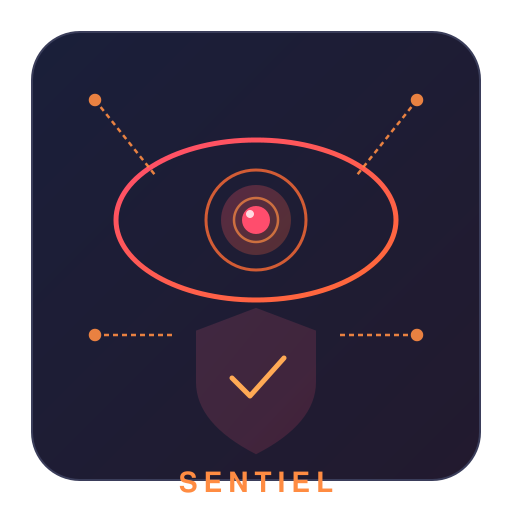

<p align="center">
  
</p>

# Sentiel

**Observability, data loss prevention, and compliance for AI agent ecosystems.**

Sentiel is the observability layer of the agent governance ecosystem. It collects
telemetry from all components (Hive, Patroclus, Relay, Miser), inspects tool call
inputs/outputs for sensitive data, provides a unified dashboard, and generates
compliance reports.

## Role in the Ecosystem

```
Hive          Patroclus       Relay          Miser        Sentiel        Aegis
─────         ─────────       ─────          ─────        ───────        ─────
Agent         Authz           MCP Proxy      Cost         Observability  Network
Runtime       Infrastructure  & Tool         Optimization & DLP          Enforcement
& Orchestration                Gateway                    & Compliance   & Attestation
```

Sentiel answers:
- "What are my agents doing right now?"
- "Did any agent expose sensitive data?"
- "How much is each agent costing me?"
- "Is my audit trail compliant with SOC2/GDPR/EU AI Act?"
- "Are there anomalous patterns I should investigate?"

## Capabilities

### Telemetry Collection
- Receives events from all ecosystem components via HTTP webhook
- Correlates by `session_id` across components
- Stores in SQLite for querying and reporting
- Real-time event stream via SSE

### Data Loss Prevention (DLP)
- Inspects tool call inputs and outputs for sensitive data patterns
- Detects: PII (email, SSN, phone, credit card), API keys, secrets, tokens
- Configurable patterns (regex-based, with severity levels)
- Blocks or redacts sensitive data before it reaches upstream services

### Anomaly Detection
- Detects unusual agent behavior patterns:
  - Spending spikes (sudden cost increase)
  - Repeated denials (agent stuck trying forbidden actions)
  - Unusual activity times (off-hours access)
  - Data volume anomalies (bulk data export)
  - Rate limit violations

### Compliance Reporting
- Generates reports from audit data:
  - SOC 2 (access controls, audit trail, change management)
  - GDPR (data access, retention, subject rights)
  - EU AI Act (risk classification, human oversight, transparency)
  - HIPAA (PHI access, audit controls)
- Exportable as JSON or CSV

### Unified Dashboard
- Agent activity timeline (across all components)
- Cost breakdown per agent/session/model
- Authorization decision summary (allow/deny/approval)
- DLP violation alerts
- Anomaly alerts
- Audit trail explorer

## Quick Start

```bash
cargo build --release
./target/release/sentiel serve --config config.toml
# Dashboard: http://localhost:8585
# API: http://localhost:8585/api
```

## Architecture

```
┌──────────────────────────────────────────────────────────────────┐
│                         SENTIEL                                   │
│                                                                  │
│  ┌──────────┐  ┌──────────┐  ┌──────────┐  ┌──────────────┐    │
│  │  Event   │  │  DLP     │  │  Anomaly │  │  Compliance  │    │
│  │  Ingest  │─▶│  Engine  │─▶│  Engine  │─▶│  Reporter    │    │
│  └────┬─────┘  └──────────┘  └──────────┘  └──────────────┘    │
│       │                                                          │
│       ▼                                                          │
│  ┌──────────┐  ┌──────────┐  ┌──────────────────────────┐      │
│  │  Event   │  │  Query   │  │  Dashboard (HTML+SSE)    │      │
│  │  Store   │  │  API     │  │                          │      │
│  │ (SQLite) │  │  (REST)  │  │  - Agent timeline        │      │
│  └──────────┘  └──────────┘  │  - Cost breakdown        │      │
│                               │  - DLP violations        │      │
│                               │  - Audit explorer        │      │
│                               │  - Anomaly alerts        │      │
│                               └──────────────────────────┘      │
└──────────────────────────────────────────────────────────────────┘
         ▲              ▲              ▲              ▲
         │              │              │              │
    Patroclus       Relay          Miser          Hive
    (authz          (tool calls)   (LLM cost)     (agent
     decisions)                                     activity)
```

## Integration

Each component sends events to Sentiel via HTTP POST:

```bash
# Patroclus sends authorization decisions
curl -X POST http://localhost:8585/api/events \
  -d '{"source":"patroclus","session_id":"abc","type":"authz_decision","decision":"allow","agent_id":"...",...}'

# Relay sends tool call events
curl -X POST http://localhost:8585/api/events \
  -d '{"source":"relay","session_id":"abc","type":"tool_call","tool":"github/list_repos","status":"success",...}'

# Miser sends cost events
curl -X POST http://localhost:8585/api/events \
  -d '{"source":"miser","session_id":"abc","type":"llm_cost","model":"gpt-4o-mini","cost":0.0001,...}'

# Hive sends agent activity events
curl -X POST http://localhost:8585/api/events \
  -d '{"source":"hive","session_id":"abc","type":"delegation","agent_id":"...","task":"...",...}'
```

## Status

**Early development.**

## License

MIT
